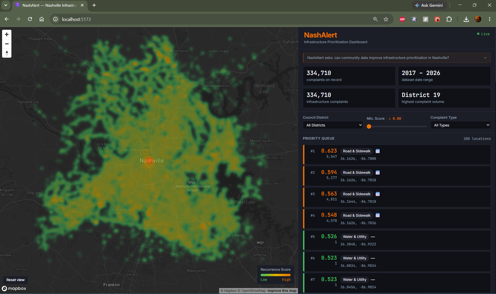
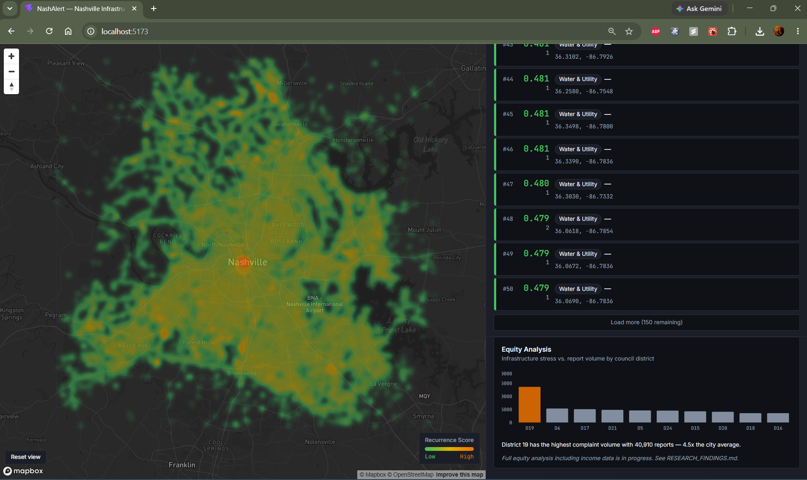

# NashAlert

A civic infrastructure reporting and prioritization system for Nashville, TN.

---

## Research Questions

This project is organized around two related research questions, one operational and one equity-focused:

**Primary question:**
> Can community-sourced real-time infrastructure reports, when combined with historical Nashville 311 open data and a recurrence-weighted scoring algorithm, produce a more informed and defensible infrastructure maintenance priority queue than complaint volume alone?

**Secondary question:**
> Do lower-income Nashville census tracts exhibit higher infrastructure complaint recurrence rates relative to their 311 report volume — and if so, does this disparity suggest systematic underreporting that a passive complaint-driven prioritization system would fail to correct?

---

## Overview

NashAlert processes nine years of Nashville 311 service request data — 334,710 infrastructure-relevant complaints filed between 2017 and 2026 — to compute location-level recurrence scores that surface persistent, multi-year infrastructure problems a naive complaint count would obscure. The system assigns each complaint a severity weight based on failure type, applies exponential decay to down-weight resolved historical complaints, and aggregates these signals into a composite score across a geospatial grid covering Nashville. A web-based city planner dashboard renders this scoring as a heatmap and exposes a prioritized maintenance queue, with a secondary equity analysis panel examining whether recurrence scores and complaint volumes correlate differently across council districts by income level. The project addresses a structural limitation of reactive 311 systems: each complaint is treated as an isolated event rather than a signal in a pattern, and neighborhoods with lower digital access or civic engagement capacity may be systematically underrepresented in the data that drives maintenance allocation.

---

## Dashboard

The city planner dashboard provides a map-centered interface for exploring infrastructure recurrence patterns across Nashville.




The heatmap layer visualizes composite recurrence scores across Nashville's geographic grid, with orange indicating highest-priority locations. The right panel presents a filtered priority queue of locations ranked by score, a location detail view showing the temporal distribution of complaint history, and an equity analysis panel breaking down complaint density and average recurrence scores by council district.

---

## What's Built

- Nashville 311 dataset ingested and cleaned: 334,710 infrastructure complaints, 2017–2026, stored in PostGIS-enabled Supabase database
- Spatiotemporal recurrence scoring engine computing composite infrastructure risk scores across 30,979 geospatial grid points using exponential decay weighting, severity-weighted complaint categorization, and resolution time analysis
- City planner dashboard (React + Mapbox GL JS) with heatmap visualization of recurrence scores, filtered priority queue ranked by score, location detail panel with temporal complaint chart, and equity analysis panel by council district
- Backend API (Node/Express) with endpoints for scoring, heatmap bounds, priority queue, temporal analysis, and community report submission
- Nightly batch scoring job precomputing recurrence scores across Nashville's geographic grid

---

## In Progress

- Statistical anomaly detection: identifying locations where recent complaint volume significantly exceeds historical seasonal baselines using z-score analysis
- Spatiotemporal KDE-based prediction: forecasting infrastructure complaint hotspots 30 and 90 days ahead using kernel density estimation with temporal weighting
- Inspection routing optimization: greedy orienteering algorithm for allocating inspection crews to maximize recurrence score coverage subject to travel distance constraints
- Mobile reporting app (React Native/Expo): community-facing interface for submitting infrastructure reports

---

## Research Methodology

The scoring formula, severity weight decisions, data quality choices, and equity analysis methodology are fully documented in [METHODOLOGY.md](docs/METHODOLOGY.md).

---

## Data Sources

Full provenance, download instructions, and known limitations for all datasets are documented in [DATA_SOURCES.md](docs/DATA_SOURCES.md). The two primary sources are the [Nashville Metro Open Data Portal](https://data.nashville.gov/datasets/9fe11d5a413240ed968f5c8d71877944_0) (311 service request history, 2017–2026) and the [U.S. Census Bureau American Community Survey](https://data.census.gov) (census tract-level median household income for Davidson County, TN).

---

## Stack

Node.js · Express · React · TypeScript · Python · Supabase/PostGIS · Mapbox GL JS · Recharts · scikit-learn · geopandas

---

## Project Structure

```
nashalert/
├── mobile/        # Expo React Native app (community reporting interface)
├── dashboard/     # React web app (Vite) — city planner dashboard
├── backend/       # Node/Express API and batch scoring job
├── data/          # Raw Nashville datasets (gitignored)
└── docs/          # Research documentation: methodology, changelog, data sources, findings
```

---

## Status

The data foundation, scoring engine, backend API, and city planner dashboard are complete. Statistical anomaly detection, spatiotemporal KDE-based hotspot prediction, inspection routing optimization, and the mobile reporting app are actively in development. The equity analysis panel displays council district-level data but the full tract-level income join and regression analysis await completion of the Census ACS integration. This README will be expanded with research findings once the equity analysis and AI modules are complete.
