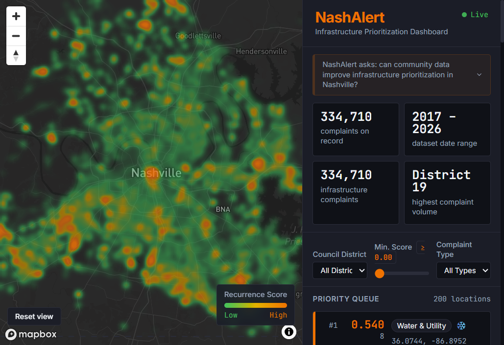
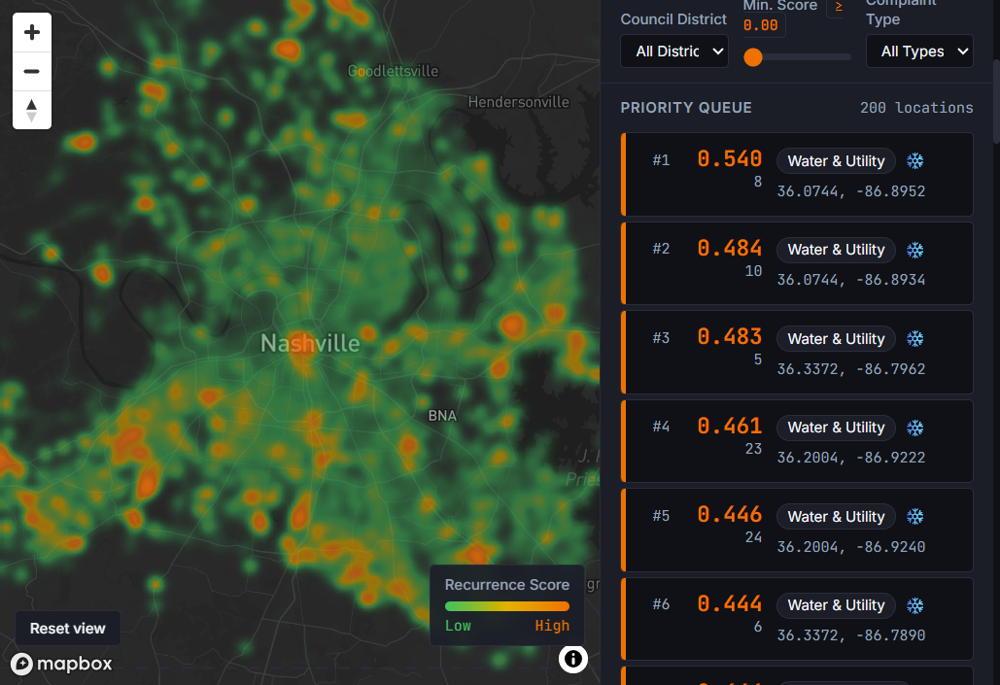
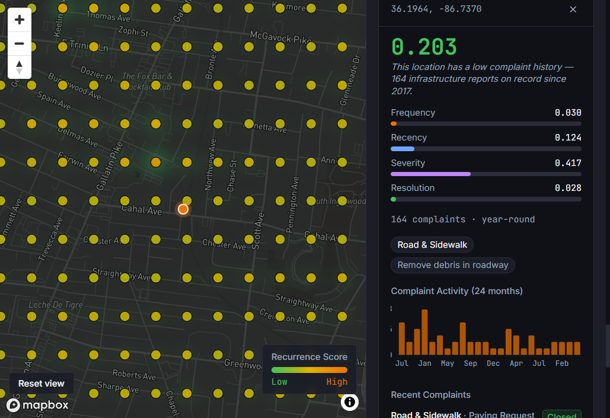
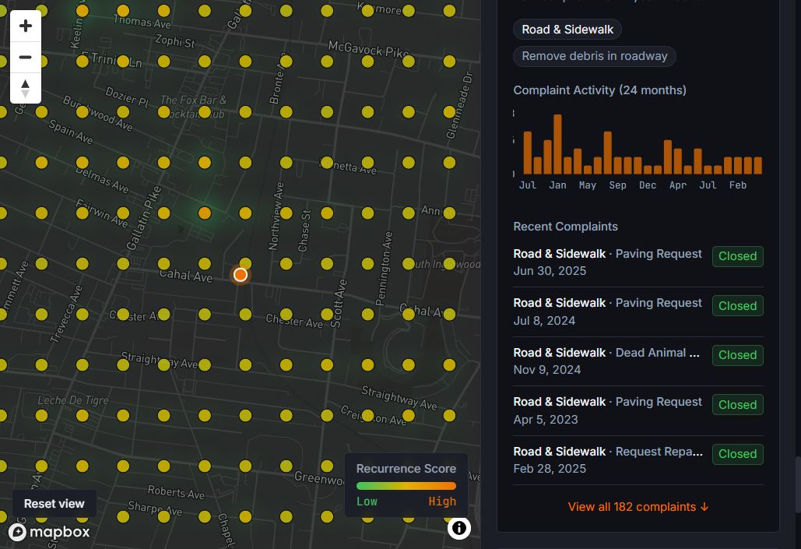
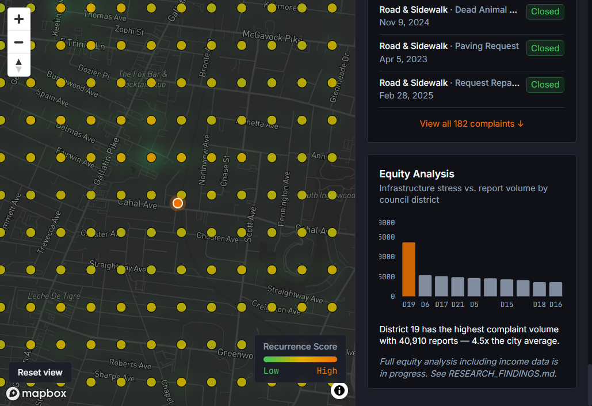

# NashAlert

A civic infrastructure reporting and prioritization system for Nashville, TN.

---

## Research Questions

This project is organized around two related research questions, one operational and one equity-focused:

**Primary question:**
> Can community-sourced real-time infrastructure reports, when combined with historical Nashville 311 open data and a recurrence-weighted scoring algorithm, produce a more informed and defensible infrastructure maintenance priority queue than complaint volume alone?

**Secondary question:**
> Do lower-income Nashville census tracts exhibit higher infrastructure complaint recurrence rates relative to their 311 report volume — and if so, does this disparity suggest systematic underreporting that a passive complaint-driven prioritization system would fail to correct?

---

## Overview

NashAlert processes nine years of Nashville 311 service request data — 334,710 infrastructure-relevant complaints across 16 request types, filed between 2017 and 2026 — to compute location-level recurrence scores that surface persistent, multi-year infrastructure problems a naive complaint count would obscure. The system assigns each complaint a severity weight based on failure type, applies exponential decay so that older complaints count for less than recent ones, separately rewards locations whose complaints take longer to close, and aggregates these signals into a composite score across a geospatial grid covering Nashville. A web-based city planner dashboard renders this scoring as a heatmap and exposes a prioritized maintenance queue, alongside an equity panel that currently breaks down complaint volume by council district. The project addresses a structural limitation of reactive 311 systems: each complaint is treated as an isolated event rather than a signal in a pattern, and neighborhoods with lower digital access or civic engagement capacity may be systematically underrepresented in the data that drives maintenance allocation.

The central empirical result so far is that this scoring surfaces a very different set of locations than complaint volume does. The top 20 distinct sites in the priority queue have a median complaint count of **6** — locations a volume-based sort would never reach. That finding holds across every scoring weight configuration tested, rather than depending on a particular choice of weights. See [RESEARCH_FINDINGS.md](docs/RESEARCH_FINDINGS.md) for the full results, including what the analysis does *not* establish.

---

## Dashboard

The city planner dashboard provides a map-centered interface for exploring infrastructure recurrence patterns across Nashville.







The heatmap layer visualizes composite recurrence scores across Nashville's geographic grid, with orange indicating highest-priority locations. Because the score distribution is tightly compressed, the heatmap weights each point steeply — contributing near zero below the median and ramping between the 90th and 99.9th percentiles — so density registers only where elevated scores cluster. Green therefore means "below the 90th percentile," not "low," and the absence of a hotspot is not evidence that an area is free of infrastructure stress. The right panel presents a filtered priority queue of locations ranked by score, a location detail view showing the temporal distribution of complaint history, and an equity panel breaking down complaint volume by council district.

One caveat matters for reading the queue: it currently ranks 200m **grid cells** rather than deduplicated places, so a single physical site can occupy several consecutive ranks. Under the deployed weighting the top 30 entries resolve to roughly 15 distinct sites. This is a known defect with a known fix (spatial deduplication before presentation) and is not yet implemented.

---

## What's Built

- Nashville 311 dataset ingested and cleaned: 334,710 infrastructure complaints across 16 request types, 2017–2026, stored in PostGIS-enabled Supabase database
- Spatiotemporal recurrence scoring engine computing composite infrastructure risk scores across 30,979 geospatial grid points using exponential decay weighting, severity-weighted complaint categorization, and resolution time analysis
- Weight sensitivity analysis and weight-space sweep quantifying how much the priority ranking actually depends on the scoring weights, reported in [METHODOLOGY.md](docs/METHODOLOGY.md) §4.9
- City planner dashboard (React + Mapbox GL JS) with heatmap visualization of recurrence scores, filtered priority queue ranked by score, location detail panel with temporal complaint chart, and equity panel showing complaint volume by council district
- Backend API (Node/Express) with endpoints for scoring, heatmap bounds, priority queue, temporal analysis, and community report submission
- Nightly batch scoring job precomputing recurrence scores across Nashville's geographic grid

---

## In Progress

- Statistical anomaly detection: identifying locations where recent complaint volume significantly exceeds historical seasonal baselines using z-score analysis
- Spatiotemporal KDE-based prediction: forecasting infrastructure complaint hotspots 30 and 90 days ahead using kernel density estimation with temporal weighting
- Inspection routing optimization: greedy orienteering algorithm for allocating inspection crews to maximize recurrence score coverage subject to travel distance constraints
- Mobile reporting app (React Native/Expo): community-facing interface for submitting infrastructure reports

---

## Research Methodology

Each grid point receives a composite recurrence score from four sub-scores, all normalized to 0–1:

```
recurrence_score = 0.15 * frequency    # complaints nearby / citywide max
                 + 0.40 * recency      # exponential decay, 365-day half-life
                 + 0.35 * severity     # mean severity weight of the complaints
                 + 0.10 * resolution   # slower historical closure scores higher
```

The result is multiplied by a confidence factor, `min(1, n/5)`, so locations with fewer than five complaints are discounted. Scores are precomputed nightly rather than per request.

These weights are **not calibrated**. They were specified from design reasoning, then revised once when analysis showed the original 40/30/20/10 did not describe the formula's actual behavior — normalizing frequency against the citywide maximum (5,547 complaints) collapsed its effective contribution to under 1% of the composite across most of the city. No ground-truth data on Nashville maintenance outcomes exists to calibrate any weight vector against. A weight-space sweep ([METHODOLOGY.md](docs/METHODOLOGY.md) §4.9) shows this matters less than it might appear: the ranking is locally stable, and moving across the entire distance between the two configurations changes only 2 of the top 20 sites.

The scoring formula, severity weight decisions, data quality choices, and equity analysis methodology are fully documented in [METHODOLOGY.md](docs/METHODOLOGY.md).

---

## Findings

Results established so far, with the reasoning and counter-evidence, are in [RESEARCH_FINDINGS.md](docs/RESEARCH_FINDINGS.md). In brief:

- Recurrence scoring surfaces a substantially different set of locations than complaint volume. The top 20 distinct sites have a median complaint count of 6, and this holds across the full range of weights tested rather than under one favorable configuration.
- The priority queue's apparent sensitivity to the scoring weights was mostly an artifact of ranking grid cells instead of places. After spatial deduplication, the two weight configurations share 18 of their top 20 sites.
- The **secondary (equity) research question is not yet answered.** It requires the Census ACS tract-level income join, which is incomplete. No claim about infrastructure burden by income level is made anywhere in this repository.

---

## Limitations

Stated plainly, because these bound what the current system can support:

- **The queue ranks grid cells, not places.** A single site can occupy several consecutive ranks; the top 30 entries resolve to roughly 15 distinct sites. No output should be read as a ranking of distinct physical locations until deduplication is implemented.
- **The scoring weights are uncalibrated** and cannot be validated without Metro work-order and asset-condition data that is not public.
- **Recurrence score is not a measure of infrastructure condition.** It measures complaint-based evidence, which carries the same reporting biases the equity analysis is meant to test for. A low score may mean good infrastructure or a neighborhood that does not file complaints — the data cannot distinguish these.
- **The confidence factor is being out-run.** Because corroboration is a multiplier, raising the recency and severity weights raises what a single recent severe report can score before the discount, so the same multiplier gates less. Locations with three complaints reach the top 30.
- **District 19 is a confound** in any district-level comparison, carrying 40,910 complaints — about 4.4 times the city average — largely because it covers a large area including downtown.
- **The compressed score distribution is a property of the formula,** not a measurement of how geographically concentrated Nashville's infrastructure stress is.
- **The dataset is a static snapshot.** Production use would require an incremental sync job.

---

## Data Sources

Full provenance, download instructions, and known limitations for all datasets are documented in [DATA_SOURCES.md](docs/DATA_SOURCES.md). The two primary sources are the [Nashville Metro Open Data Portal](https://data.nashville.gov/datasets/9fe11d5a413240ed968f5c8d71877944_0) (311 service request history, 2017–2026) and the [U.S. Census Bureau American Community Survey](https://data.census.gov) (census tract-level median household income for Davidson County, TN).

---

## Stack

Node.js · Express · React · TypeScript · Python · Supabase/PostGIS · Mapbox GL JS · Recharts · scikit-learn · geopandas

---

## Project Structure

```
nashalert/
├── mobile/        # Expo React Native app (community reporting interface)
├── dashboard/     # React web app (Vite) — city planner dashboard
├── backend/       # Node/Express API and batch scoring job
├── data/          # Raw Nashville datasets (gitignored)
└── docs/          # Research documentation: methodology, changelog, data sources, findings
```

---

## Research Agenda

NashAlert is a prototype, not a research contribution. The scoring weights are heuristic, the anomaly detection assumes normality, and the system has no model of how Nashville's complaint distribution shifts over time. A full statement of the PhD-level research questions this prototype motivates — including debiased observation modeling, POMDP-based maintenance allocation under partial observability, and online adaptation to non-stationary demand — is in [docs/RESEARCH_AGENDA.md](docs/RESEARCH_AGENDA.md).

---

## Status

The data foundation, scoring engine, backend API, and city planner dashboard are complete. Statistical anomaly detection, spatiotemporal KDE-based hotspot prediction, inspection routing optimization, and the mobile reporting app are actively in development.

Two gaps affect what can currently be claimed. The equity panel displays council district-level complaint volume, but the tract-level income join and regression analysis await the Census ACS integration — so the secondary research question is open. And because the mobile app is still in development, no community-sourced reports exist yet; the primary research question is therefore currently evaluated against historical 311 data alone, which tests the scoring methodology but not the "community-sourced reports improve prioritization" half of the claim.

Findings established to date are recorded in [RESEARCH_FINDINGS.md](docs/RESEARCH_FINDINGS.md) and will be extended as the equity analysis and remaining modules are completed.
